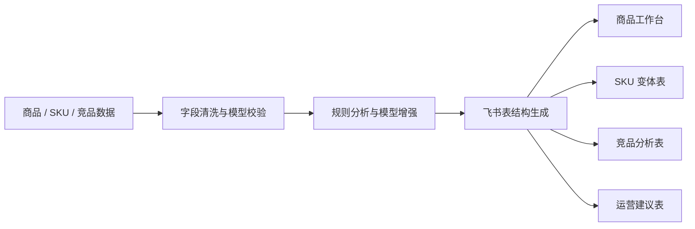

# 电商商品数据分析与飞书自动化工作台

用于把商品、SKU、竞品与模型分析结果同步到飞书多维表格的 Python 工具。系统围绕“数据清洗 -> 结构化分析 -> 飞书工作台同步”构建，适用于商品运营、竞品整理、选品复盘和运营协作场景。

## 核心能力

- 商品数据建模：使用 Pydantic 校验商品、SKU、竞品、采集状态、审核状态和模型建议字段。
- 飞书工作台同步：自动创建 Base、数据表、字段、记录、附件图片、URL 字段、筛选视图、画册视图和看板视图。
- 模型服务接入：支持 DeepSeek、OpenAI 和 OpenAI-compatible 自定义接口，用于补充分类建议、商品定位、标签建议和运营动作。
- 竞品分析：基于同价位商品池生成竞品共性、主商品差异点、机会方向、风险提示和审核项。
- 失败降级：模型调用、图片上传或飞书同步失败时保留本地结构化结果，并记录失败状态，避免中断整批数据处理。

## 架构复用点

```text
src/
  ai_client.py             # OpenAI-compatible 模型服务适配层
  ai_enrichment.py         # 店铺商品数据的模型增强流程
  feishu_client.py         # 飞书 Base / 表 / 字段 / 记录 / 视图 / 附件同步
  feishu_schema.py         # 通用表结构与字段类型抽象
  shop_workbench_schema.py # 商品运营工作台 schema
  jd_feishu_schema.py      # 竞品分析工作台 schema
  generator.py             # 商品标题、卖点、平台文案与审核项生成
  competitor_analysis.py   # 竞品共性、差异点、机会方向与风险提示
  jd_parser.py             # 商品页 HTML 字段解析
  jd_scraper.py            # 浏览器辅助采集流程
```

核心抽象：

- `TablePayload`：描述飞书表、字段、记录、视图和附件上传计划。
- `ViewPayload` / `ViewFilter`：描述飞书视图和筛选条件。
- `AIConfig` / `AIClient`：封装模型服务 provider、base URL、模型名、鉴权和 JSON 响应解析。
- `ProductInput` / `ProductOutput` / `CompetitorWorkbenchOutput`：将输入、分析结果和飞书同步解耦。

## 工作流



## 快速开始

```powershell
python -m venv .venv
.\.venv\Scripts\Activate.ps1
pip install -r requirements.txt
python -m pytest -q
```

商品信息生成：

```powershell
python -m src.main --input samples/products.json --dry-run true
```

商品运营工作台：

```powershell
python -m src.main sync-shop-workbench --input samples/shop-workbench.example.json --dry-run true --upload-images true
```

竞品分析工作台：

```powershell
python -m src.main analyze-competitors --input samples/jd-lamp-urls.example.json --dry-run true --headful true
```

真实 URL 文件请使用 `samples/*.local.json`，该类文件已加入 `.gitignore`。

## DeepSeek 接入

默认不调用外部模型服务。需要启用 DeepSeek 时，在 `.env` 中配置：

```text
AI_PROVIDER=deepseek
AI_API_KEY=你的 API Key
AI_MODEL=deepseek-v4-flash
```

DeepSeek 默认接口地址为 `https://api.deepseek.com`，通常不需要填写 `AI_BASE_URL`。

运行示例：

```powershell
python -m src.main sync-shop-workbench --input samples/shop-workbench.example.json --dry-run true --ai-provider deepseek
```

模型输出会写入分类建议、商品定位、标签建议、运营建议、审核提示和生成状态字段。调用失败时，程序保留规则分析结果并记录失败原因。

## OpenAI 与兼容接口

OpenAI：

```text
AI_PROVIDER=openai
AI_API_KEY=你的 API Key
AI_MODEL=gpt-4o-mini
```

自定义 OpenAI-compatible 服务：

```text
AI_PROVIDER=custom
AI_API_KEY=你的 API Key
AI_MODEL=你的模型名
AI_BASE_URL=https://your-api.example.com/v1
```

## 飞书同步

复制 `.env.example` 为 `.env` 并填写飞书应用配置：

```text
FEISHU_APP_ID=cli_xxxxxxxxxxxxxxxx
FEISHU_APP_SECRET=xxxxxxxxxxxxxxxxxxxxxxxxxxxxxxxx
```

同步到飞书：

```powershell
python -m src.main sync-shop-workbench --input samples/shop-workbench.example.json --dry-run false --upload-images true
```

图片字段会优先上传为飞书附件。上传失败时，系统保留图片 URL 和上传状态，不影响其他记录同步。

## 测试

```powershell
python -m pytest -q --basetemp .pytest-tmp
```

测试覆盖：

- 输入 JSON 校验
- 商品内容生成
- DeepSeek/OpenAI-compatible 响应解析
- 模型增强失败降级
- 京东 URL 数量校验
- 商品页/搜索页解析 fixture
- 台灯参数规则抽取
- 飞书字段类型、附件、URL、单选、多选、视图过滤和隐藏字段
- 商品工作台与竞品工作台 schema

## 文档

- [架构说明](docs/architecture.md)
- [数据契约](docs/data-contracts.md)
- [数据治理](docs/data-governance.md)
- [依赖与集成](docs/dependencies.md)
