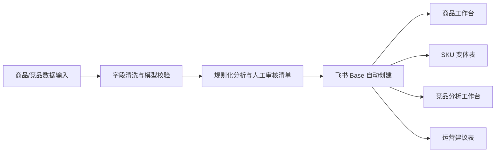

# 电商商品数据分析与飞书自动化工作台

这是一个面向电商运营、商品运营和 AI 赋能运营场景的个人项目。项目把商品基础数据、SKU 变体、竞品商品和规则化分析结果同步到飞书多维表格，形成可筛选、可视化、可人工审核的数据工作台。

## 项目亮点

- 商品数据结构化：沉淀商品名称、价格带、商品定位、SKU、主图、标签、店铺、链接、采集状态等运营字段。
- 飞书自动化同步：通过飞书 OpenAPI 自动创建 Base、数据表、字段、附件图片、URL 字段、单选/多选标签、筛选视图和图库视图。
- 竞品分析工作台：围绕同价位竞品生成竞品池、共性归纳、主商品差异点、机会方向、运营建议和人工审核清单。
- AI 运营边界：使用可测试的规则化分析模板，不虚构销量、排名、GMV、转化率或真实商家使用效果。

## 技术栈

- Python 3
- 飞书多维表格 OpenAPI / `lark-oapi`
- `pydantic`：输入数据校验与结构化模型
- `python-dotenv`：本地密钥配置
- `beautifulsoup4`：HTML 解析与离线 fixture 测试
- `Playwright` / `DrissionPage`：可选浏览器自动化能力，用于人工可控的数据采集流程
- `pytest`：单元测试与回归验证

## 工作流



## 功能模块

### 1. 商品信息生成

读取商品 JSON，生成商品标题、核心卖点、平台口吻文案、标签和人工检查清单，并可同步到飞书多维表格。

```powershell
python -m src.main --input samples/products.json --dry-run true
```

### 2. 商品运营视觉工作台

读取清洗后的店铺商品数据，创建飞书视觉工作台：

- `运营总览表`
- `店铺主要商品表`
- `SKU款式变体表`
- `竞品任务/分析表`
- `运营建议表`

```powershell
python -m src.main sync-shop-workbench --input samples/shop-workbench.example.json --dry-run true --upload-images true
```

同步到飞书时会使用附件字段上传商品主图。若图片上传失败，程序会保留图片 URL 和失败原因，不中断整批同步。

### 3. 竞品分析工作台

输入 1 个主商品 URL 和 10 个竞品 URL，生成本店商品表、竞品商品表、竞品对比分析表和运营建议表。竞品表同样支持附件主图、商品链接、价格数值、采集状态和图库视图。

```powershell
python -m src.main analyze-competitors --input samples/jd-lamp-urls.example.json --dry-run true --headful true
```

真实 URL 文件请使用 `samples/*.local.json`，该类文件已加入 `.gitignore`。

## 快速开始

```powershell
python -m venv .venv
.\.venv\Scripts\Activate.ps1
pip install -r requirements.txt
python -m pytest -q
```

## AI API 接入

项目默认不调用外部 AI API。需要启用 AI 分类和运营建议时，在 `.env` 中配置：

```text
AI_PROVIDER=deepseek
AI_API_KEY=你的 API Key
AI_MODEL=deepseek-chat
```

也可以使用 OpenAI 或兼容接口：

```text
AI_PROVIDER=openai
AI_API_KEY=你的 API Key
AI_MODEL=gpt-4o-mini
```

自定义兼容接口需要补充 `AI_BASE_URL`。启用后可在命令中指定：

```powershell
python -m src.main --input samples/products.json --dry-run true --ai-provider deepseek
python -m src.main sync-shop-workbench --input samples/shop-workbench.example.json --dry-run true --ai-provider deepseek
python -m src.main analyze-competitors --input samples/jd-lamp-urls.example.json --dry-run true --ai-provider deepseek
```

AI 输出会写入分类建议、商品定位、标签建议、运营建议、审核提示和生成状态字段。若 API 调用失败，程序保留规则化结果并记录失败原因。

如需同步到飞书：

1. 在飞书开放平台创建企业自建应用。
2. 开通多维表格、云文档附件上传等相关权限。
3. 复制 `.env.example` 为 `.env` 并填写：

```text
FEISHU_APP_ID=cli_xxxxxxxxxxxxxxxx
FEISHU_APP_SECRET=xxxxxxxxxxxxxxxxxxxxxxxxxxxxxxxx
```

4. 执行同步命令：

```powershell
python -m src.main sync-shop-workbench --input samples/shop-workbench.example.json --dry-run false --upload-images true
```

## 目录结构

```text
src/
  main.py                  # CLI 入口
  feishu_client.py         # 飞书 Base/表/记录/视图/附件同步
  feishu_schema.py         # 通用飞书表结构
  shop_workbench_schema.py # 商品运营视觉工作台 schema
  jd_feishu_schema.py      # 竞品分析视觉工作台 schema
  competitor_analysis.py   # 规则化竞品分析
  competitor_models.py     # 竞品输入/输出模型
samples/
  products.json
  shop-workbench.example.json
  jd-lamp-urls.example.json
outputs/
  sample-generated-products.json
  sample-jd-lamp-competitor-analysis.json
docs/
  project-brief.md
  open-source-references.md
  case-study.md
  security-and-data-boundary.md
```

## 扩展文档

- [项目案例说明](docs/case-study.md)
- [数据安全与发布边界](docs/security-and-data-boundary.md)
- [项目简报](docs/project-brief.md)
- [开源参考与使用边界](docs/open-source-references.md)

## 验证

```powershell
python -m pytest -q --basetemp .pytest-tmp
```

当前测试覆盖：

- 输入 JSON 校验
- 商品文案生成与高风险词检测
- 京东竞品 URL 数量校验
- 商品页/搜索页解析 fixture
- 台灯参数规则抽取
- 飞书字段类型、附件、URL、单选、多选、视图过滤和隐藏字段
- 商品工作台与竞品工作台 schema

## 项目边界

- 不声称真实商家使用。
- 不声称提升转化率、GMV、销量或排名。
- 不采集评论正文。
- 不提交 `.env`、`.browser/`、真实飞书 `app_token`、真实采集结果或本地输出文件。
- 仓库中的公开数据已做脱敏或构造处理；台灯品类用于说明商品数据清洗、竞品分析和飞书自动化同步流程。

## 开源参考

本项目只参考下列项目的产品思路、字段拆分和 README 组织方式，不复制其代码：

- [Nutlope/description-generator](https://github.com/Nutlope/description-generator)
- [mayashavin/product-info-ai-generator](https://github.com/mayashavin/product-info-ai-generator)
- [iamarunbrahma/product-description-generator](https://github.com/iamarunbrahma/product-description-generator)

依赖能力来自官方或开源库：

- [飞书/Lark 开放平台](https://open.larksuite.com/)
- [larksuite/oapi-sdk-python](https://github.com/larksuite/oapi-sdk-python)
- [Beautiful Soup](https://www.crummy.com/software/BeautifulSoup/)
- [Playwright for Python](https://playwright.dev/python/)
- [DrissionPage](https://www.drissionpage.cn/)
